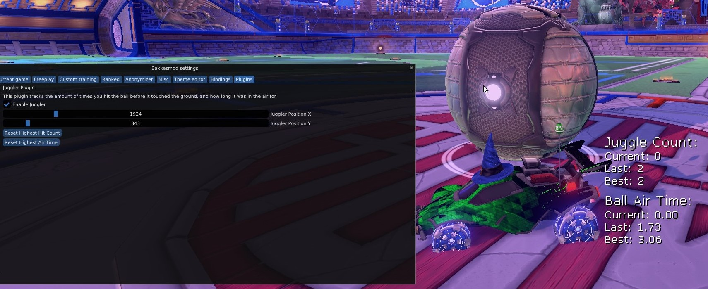

# Juggler Plugin

### Description

I wanted to know how many times I could keep the ball in the air, as well as for how long, so I built a small tracker that displays those statistics. I found it also helpful and interesting for improving my dribbling.

### Features

* Keeps track of current, last, and best # of times you hit the ball before it touched the ground again.
* Keeps track of the current, last, best, and average amount of time the ball was in the air before it touched the ground again.
* Able to position the stats anywhere on your screen within the plugin menu.
* Able to reset the totals from within the plugin menu.

### Issues

* This plugin doesn't track 'all time highs' between play sessions, it's only the active play session.

If you find an issue or have a request, open an issue on GitHub please.

### Demo

